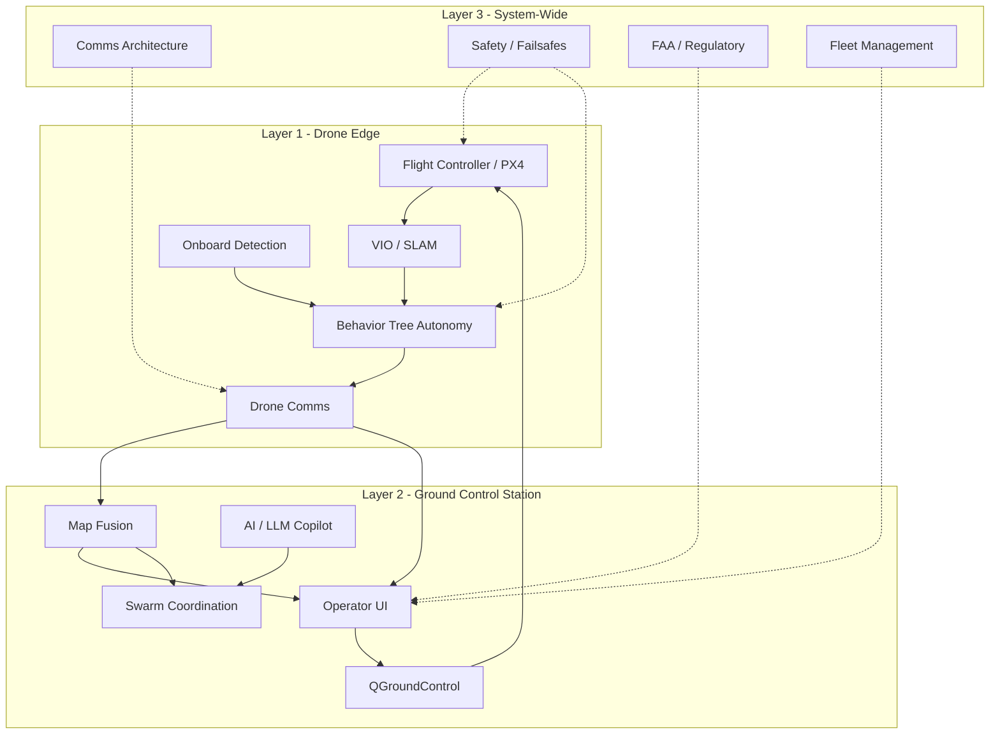
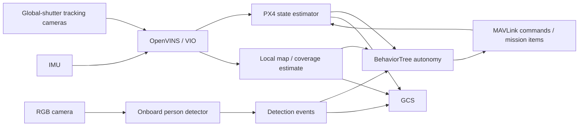
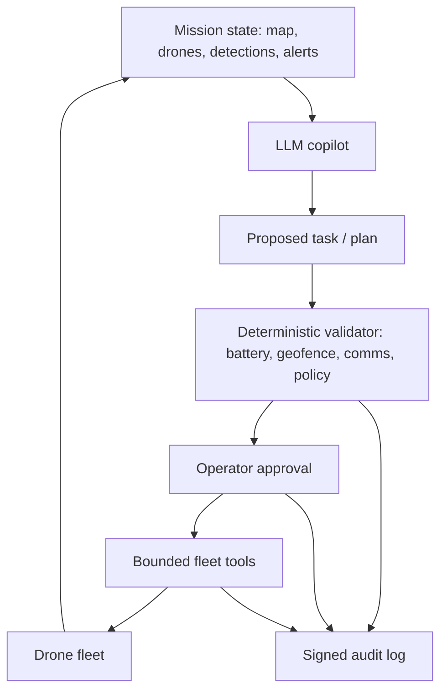
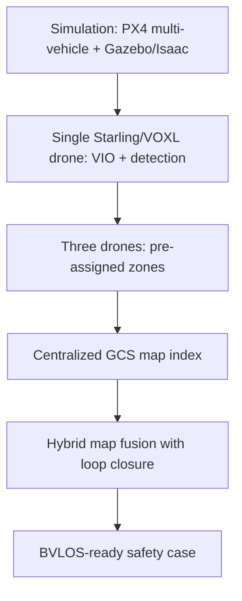

# SEEKR Diagrams

## Layered System

```mermaid
graph TB
    subgraph L1["Layer 1 - Drone Edge"]
        A[Flight Controller / PX4]
        B[VIO / SLAM]
        C[Onboard Detection]
        D[Behavior Tree Autonomy]
        E[Drone Comms]
    end
    subgraph L2["Layer 2 - Ground Control Station"]
        F[Map Fusion]
        G[AI / LLM Copilot]
        H[Operator UI]
        I[Swarm Coordination]
        Q[QGroundControl]
    end
    subgraph L3["Layer 3 - System-Wide"]
        J[Comms Architecture]
        K[Safety / Failsafes]
        L[FAA / Regulatory]
        M[Fleet Management]
    end
    A --> B
    B --> D
    C --> D
    D --> E
    E --> F
    E --> H
    F --> H
    F --> I
    G --> I
    H --> Q
    Q --> A
    J -.-> E
    K -.-> A
    K -.-> D
    L -.-> H
    M -.-> H
```

## V1 Data Flow

```mermaid
graph LR
    CAM[Global-shutter tracking cameras] --> VIO[OpenVINS / VIO]
    IMU[IMU] --> VIO
    RGB[RGB camera] --> DET[Onboard person detector]
    VIO --> PX4[PX4 state estimator]
    VIO --> MAP[Local map / coverage estimate]
    DET --> EVT[Detection events]
    PX4 --> AUTO[BehaviorTree autonomy]
    MAP --> AUTO
    EVT --> AUTO
    AUTO --> MAV[MAVLink commands / mission items]
    MAV --> PX4
    MAP --> GCS[GCS]
    EVT --> GCS
    PX4 --> GCS
```

## GCS AI Trust Boundary

```mermaid
graph TB
    State[Mission state: map, drones, detections, alerts]
    LLM[LLM copilot]
    Proposal[Proposed task / plan]
    Validator[Deterministic validator: battery, geofence, comms, policy]
    Operator[Operator approval]
    Tools[Bounded fleet tools]
    Fleet[Drone fleet]
    Logs[Signed audit log]

    State --> LLM
    LLM --> Proposal
    Proposal --> Validator
    Validator --> Operator
    Operator --> Tools
    Tools --> Fleet
    Fleet --> State
    Validator --> Logs
    Operator --> Logs
    Tools --> Logs
```

## V1 Swarm Staging

```mermaid
graph TB
    S0[Simulation: PX4 multi-vehicle + Gazebo/Isaac]
    S1[Single Starling/VOXL drone: VIO + detection]
    S2[Three drones: pre-assigned zones]
    S3[Centralized GCS map index]
    S4[Hybrid map fusion with loop closure]
    S5[BVLOS-ready safety case]

    S0 --> S1
    S1 --> S2
    S2 --> S3
    S3 --> S4
    S4 --> S5
```
